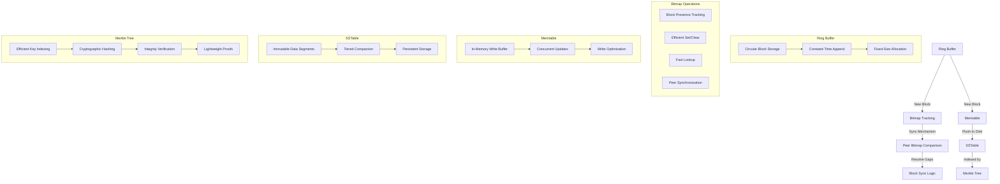
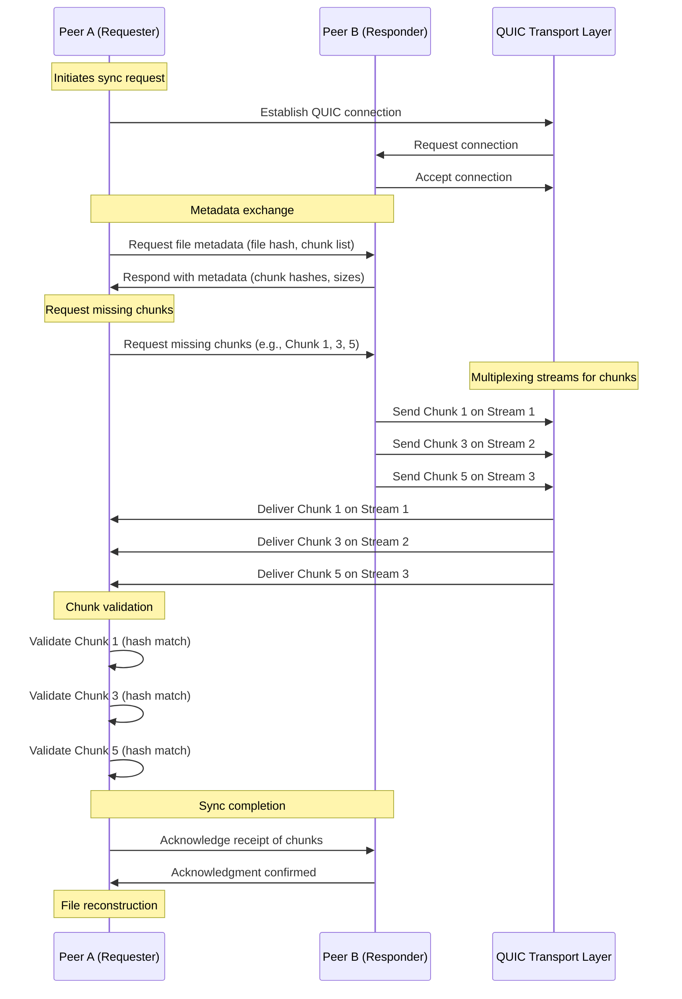

# One Chain
Dead simple Blockchain library built for identity management
using following:
1. Ring Buffer for MU blocks on Block 'chain' called BlockRing Buffer.
2. Block Ring buffer is flushed to Memtable when full 
3. Memtable is implemented as a skiplist 
4. Memtable is flushed to disk using `mmap` (no or less IO) to SSTable.

### First Attempt:


### Storage of smaller groups and smaller blockchains
A small block chain is usually referring to < 10,000 members
or blocks, which is ideal for private blockchains, data
is serialized using mmap and is faster.

#### Proposed Memory-Mapped IO Design

#### File Layout

#### A single file will contain:
	1.	Header: Metadata about the ring buffer (e.g., capacity, head, tail, cumulative hash).
	2.	Blocks: Fixed-size blocks representing members.

```ascii 
+-------------------------------+
| Header (256 bytes)            |
| - Capacity (usize)            | Total number of blocks in the file
| - Head (usize)                | Index of the head block
| - Tail (usize)                | Index of the tail block
| - Cumulative Hash ([u8; 16])  | XOR of all block hashes for chain state
| - Bitmap ([u8; 128])          | Block presence bitmap
| - SSTable Version (u32)       | For compatibility across versions
| - Timestamp (u64)             | Last write timestamp (UTC)
| - Reserved Space (40 bytes)   | Reserved for future use
+-------------------------------+
| Block Index (256 bytes)       | Metadata for quick navigation
| - Block 0 Offset (u32)        | Byte offset of Block 0
| - Block 1 Offset (u32)        | Byte offset of Block 1
| - ...                         |
| - Block N Offset (u32)        |
+-------------------------------+
| Block Data Section            | Actual block data
| Block 0 (64 bytes)            | Metadata and content
| - Block Hash ([u8; 16])       | Hash of block data
| - Data Length (u16)           | Length of the content
| - Data (variable, up to 48B)  | Actual block data
| Block 1 (64 bytes)            |
| ...                           |
| Block N (64 bytes)            |
+-------------------------------+
| Merkle Tree Root ([u8; 32])   | Cryptographic root hash
+-------------------------------+
```

### Quick Review of QUIC (used in syncing the blockchain buffers)



