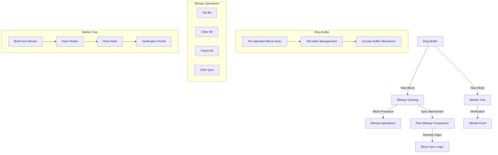

# One Chain
Dead simple Blockchain library built on top of rocksdb.

### First Attempt:


### Storage of smaller groups and smaller blockchains
A small block chain is usually referring to < 10,000 members
or blocks, which is ideal for private blockchains, data
is serialized using mmap and is faster.

```ascii 
+-------------------------------+
| Header (128 bytes)            |
| - Capacity (usize)            |
| - Head (usize)                |
| - Tail (usize)                |
| - Cumulative Hash ([u8; 16])  |
| - Bitmap ([u8; 128])          |
+-------------------------------+
| Block 0 (32 bytes)            |
| Block 1 (32 bytes)            |
| ...                           |
| Block N (32 bytes)            |
+-------------------------------+
```