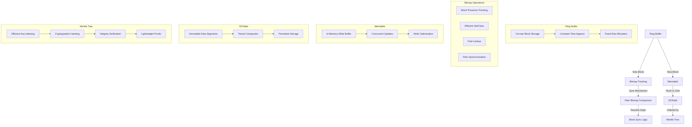
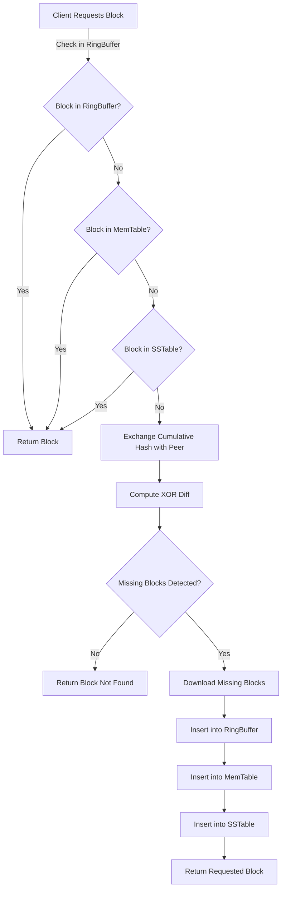

# One Chain
Dead simple Blockchain library built for identity management
using following:
1. Ring Buffer for MU blocks on Block 'chain' called BlockRing Buffer.
2. Block Ring buffer is flushed to Memtable when full 
3. Memtable is implemented as a skiplist 
4. Memtable is flushed to disk using `mmap` (no or less IO) to SSTable.

### Basic Flows 

NOTE: Merkle tree build is optional and would not be part of MVP.

### Storage of smaller groups and smaller blockchains
A small block chain is usually referring to < 10,000 members
or blocks, which is ideal for private blockchains, data
is serialized using mmap and is faster.

#### Proposed Memory-Mapped IO Design

#### File Layout

#### A single file will contain:
	1.	Header: Metadata about the ring buffer (e.g., capacity, head, tail, cumulative hash).
	2.	Blocks: Fixed-size blocks representing members.

```ascii 
+----------------------------------------------------+
|                   SSTableSegment                   |
+----------------------+----------------------------+
| Bloom Filter        | Index Block                  |
| (For fast lookup)   | (Key → Offset mapping)       |
+----------------------+----------------------------+
|                     Data Block                     |
|  (Sorted key-value pairs, stored in sorted order)  |
+----------------------------------------------------+
|                  Metadata Block                    |
| (Compression, timestamps, merge info, etc.)        |
+----------------------------------------------------+
|                     Footer                         |
| (Magic number, version, checksum, etc.)            |
+----------------------------------------------------+
```

Data Block values:
```ascii
+-----------+-----------+--------------------+
| Key       | Offset    | Value              |
+-----------+-----------+--------------------+
| "apple"   | 0x2000    | "fruit"            |
| "banana"  | 0x2010    | "yellow fruit"     |
| "cherry"  | 0x2020    | "red fruit"        |
+-----------+-----------+--------------------+
```
	•	Keys are sorted lexicographically (e.g., "apple" < "banana" < "cherry").
	•	The Index Block maps keys to Data Block offsets.
	•	The Bloom Filter helps avoid unnecessary lookups.

### Novel way of exchanging Diffs for P2P data exchange

